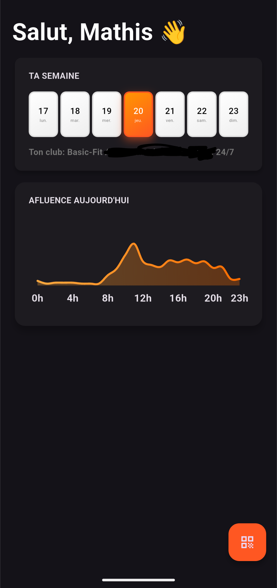

# BasicShare
BasicShare is a custom Basic Fit client application allowing QRCode sharing.

## 🏋️‍♂️ Main features
- **BasicFit account integration**: Connect directly with your BasicFit gym account
- **Authentication management**: Secure login with token refresh capabilities
- **Dashboard overview**: View your gym activities and stats at a glance
- **Adaptive interface**: Clean and intuitive user interface for optimal experience

## 📱 Supported platforms
- Android
- iOS

## 📲 Installation
### Android
Download the latest APK from the [Releases](https://github.com/szerookii/basic-share/releases) page and install it on your device.

### iOS
1. Install [AltStore](https://altstore.io/) or [SideStore](https://sidestore.io/) on your iOS device
2. Download the latest IPA from the [Releases](https://github.com/szerookii/basic-share/releases) page
3. Open the IPA file with AltStore/SideStore to install BasicShare

## 🛠️ Development
1. Clone this repository:
```bash
git clone https://github.com/szerookii/basic-share.git
```
2. Navigate to the project directory:
```bash
cd basic-share
```
3. Install dependencies:
```bash
flutter pub get
```
4. Run the application:
```bash
flutter run
```

## 🖥️ Screenshots
<div style="display: flex; flex-wrap: wrap; gap: 10px;">

</div>

## 📄 License
This project is licensed. See the [LICENSE](LICENSE) file for details.

## 🤝 Contribution
Contributions are welcome! Feel free to submit a pull request or open an issue.
